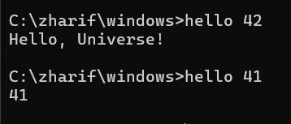
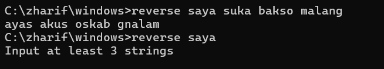

# pbkk-tugas-golang
---
### Soal
1. Program GO yang apabila diberi input 42 maka outputnya "Hello Universe!". Jika input selain 42, maka print angka yang diinputkan
2. Program GO yang bisa melakukan reverse word dari inputan user. Minimal input adalah 3 kata.

---
### build command
```
go build -o hello cmd/hello/main.go
go build -o reverse cmd/reverse/main.go
```
---
### Usage 
1. Hello universe
```
hello <number>
```
#### example:


2. Reverse Word
```
reverse <string_1> <string_2> <string_3> ...
```
#### example:
